# 🎉 Gestion des Événements Hybrides

---

## 📝 Introduction

Le projet **Gestion des événements hybrides** vise à développer une plateforme moderne et intuitive permettant la gestion d'événements hybrides — accessibles à la fois en ligne et en présentiel.

L'application cible deux types d'utilisateurs :

- 👩‍💼 **Les organisateurs** : peuvent créer et gérer leurs événements.  
- 👩‍🎓 **Les participants** : peuvent explorer les événements disponibles, s'inscrire, et choisir leur mode de participation.

👉 Cette plateforme met l’accent sur un **design moderne et responsive** grâce à **Tailwind CSS**.

  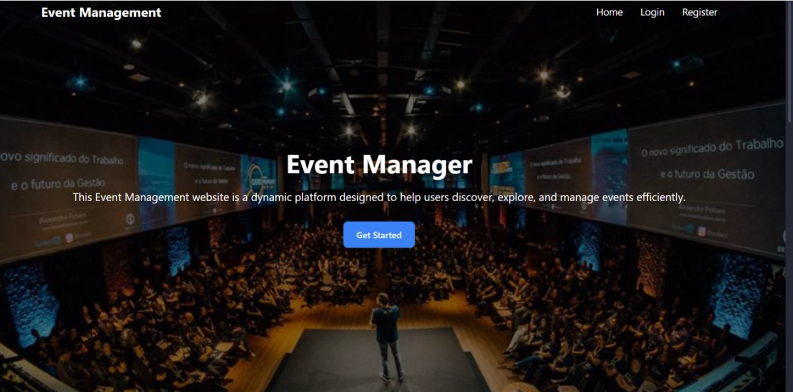

---

## 🎯 Objectifs du Projet

- **Fournir un outil de gestion d’événements** : création, modification, et suppression d’événements avec des détails complets.  
- **Offrir une interface intuitive** : consultation, recherche et filtrage d’événements.  
- **Faciliter les inscriptions** : gestion des modes de participation (en ligne ou présentiel).  
- **Proposer un tableau de bord analytique** : statistiques et graphiques sur la participation.

---

## 🧩 Bibliothèques Utilisées

### ⚙️ Backend

- **Express.js** — Framework backend  
- **Mongoose** — Modélisation MongoDB  
- **Jsonwebtoken (JWT)** — Authentification  
- **Bcryptjs** — Hashage de mots de passe  
- **Dotenv** — Variables d’environnement  

### 💻 Frontend

- **Axios** — Appels API  
- **React Router** — Navigation  
- **Recharts** — Graphiques  
- **Tailwind CSS** — Design responsive  

---

## 📦 Installation des dépendances

### Backend
    ```bash
    npm install express mongoose jsonwebtoken bcryptjs dotenv
    
### Frontend Installation
    ```bash
    npm install axios react-router-dom recharts tailwindcss


## 🧱 Plan de Réalisation

### Étape 1 : Configuration
- Initialisation des projets backend et frontend  
- Installation des dépendances nécessaires  

### Étape 2 : Développement Backend
- Création des modèles MongoDB  
- Implémentation des routes API REST  
- Tests avec Postman  

### Étape 3 : Développement Frontend
- Conception des pages principales  
- Intégration des API backend  
- Application du design avec Tailwind CSS  

### Étape 4 : Tests
- Tests API et vérification manuelle des fonctionnalités  

---

## 🏗️ Architecture du Projet

  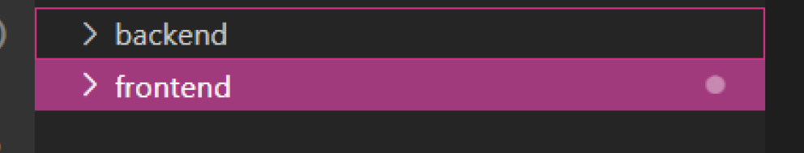

### Backend
Le backend est construit avec **Express.js** et utilise **MongoDB**.

### Frontend
Le frontend utilise **React** avec **Tailwind CSS**.

---

## 📂 Structure du Backend

  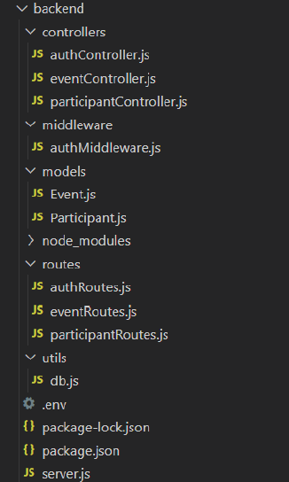


### `controllers/`

#### `authController.js`
- Gère la logique d’authentification (connexion, inscription)  
- Génère un token JWT avec durée d’une heure
- Inscription d'un utilisateur
- Génération du token
- Gestion des erreurs avec `try...catch`

  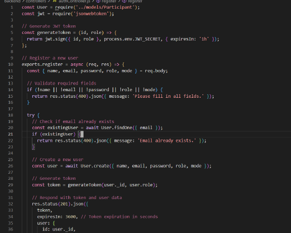

#### `eventController.js`
CRUD complet pour les événements :
- `createEvent` : création d’un événement  
- `getEvents` : récupération de tous les événements  
- `getEventById` : récupération d’un événement spécifique  
- `updateEvent` : mise à jour  
- `deleteEvent` : suppression  
- `joinEvent` / `leaveEvent` : inscription et désinscription des participants  

  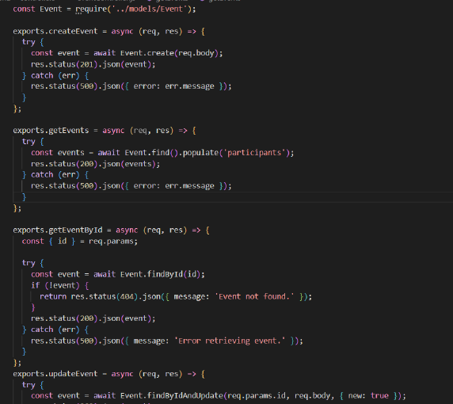

#### `participantController.js`
- `addParticipant` : ajoute un participant et met à jour l’événement  
- `getParticipantsByEvent` : retourne les participants d’un événement  

  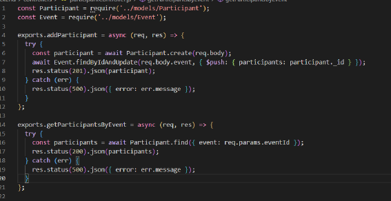

---

### `middleware/`

#### `authMiddleware.js`
- `protect` : vérifie le token JWT et authentifie l’utilisateur  
- `authorize` : autorise selon le rôle (organisateur, participant)  
  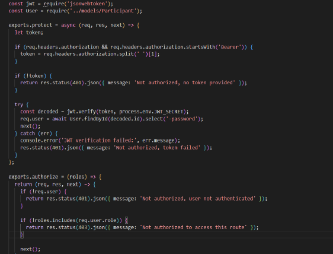

---

### `models/`
- `Event.js` : Schéma d’événement
  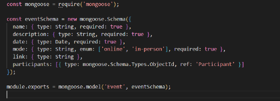

- `Participant.js` : Schéma de participant  
  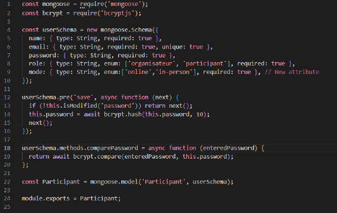

Avant sauvegarde (`pre save`) : hashage du mot de passe avec **bcrypt**  
Méthode `comparePassword` : compare le mot de passe entré et celui stocké.  

---

### `routes/`
- `authRoutes.js` : inscription & connexion (`/register`, `/login`)
    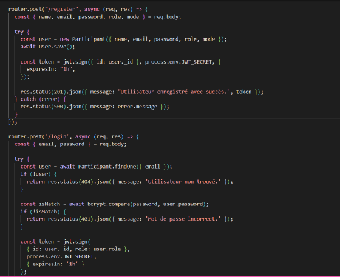
 
- `eventRoutes.js` : routes CRUD des événements
    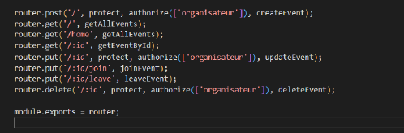

- `participantRoutes.js` : récupération des participants d’un événement  
    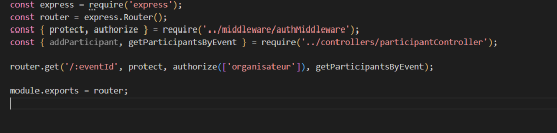

---

### `utils/db.js`
Contient la logique de connexion à **MongoDB**.
    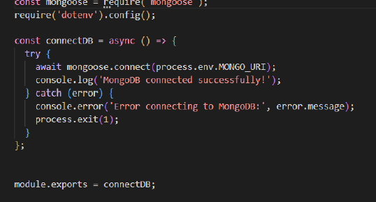

---

### `.env`
Stocke les variables d’environnement : URL de la base de données, clé JWT, etc.
    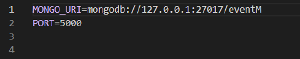

---

### `server.js`
- Point d’entrée du backend  
- Configure **Express**, **CORS**, **dotenv**, et **body-parser**  
- Connecte la base de données et lie les routes  
    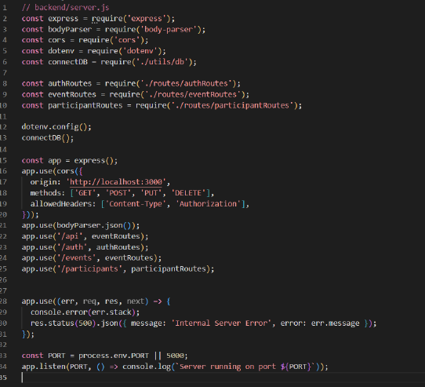

---

## 🧪 Tests Backend avec Postman

### 🔐 Authentification
- `POST /auth/register` : inscription
      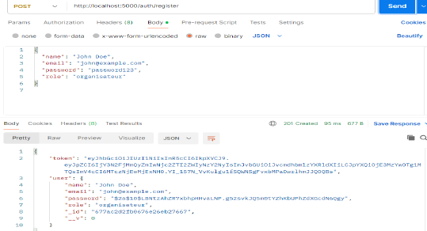

- `POST /auth/login` : connexion  
    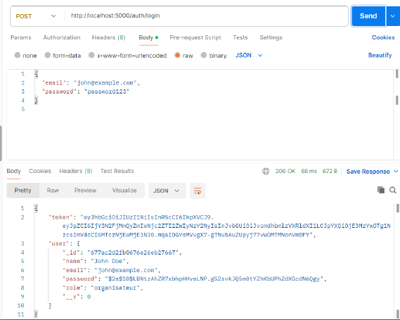

### 📅 Événements
- `POST /events` : créer un événement
      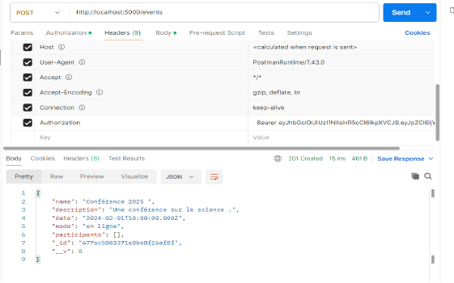
    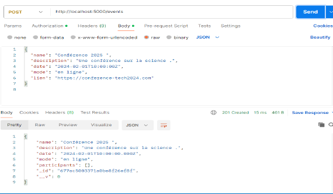


- `GET /events` : liste complète
        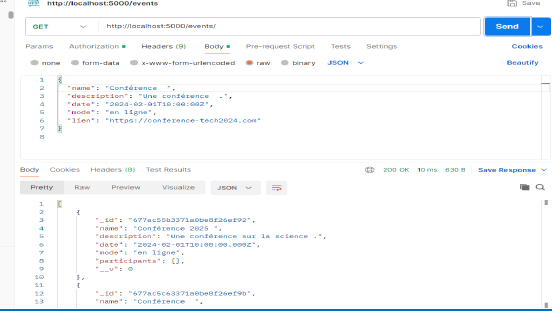

- `PUT /events/:id` : modifier
        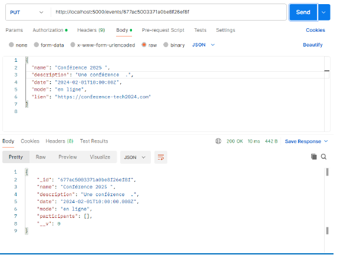

- `DELETE /events/:id` : supprimer  
      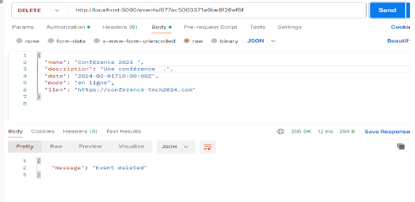

> ⚠️ Si un **participant** tente d’accéder à une route d’organisateur, la requête est refusée.
      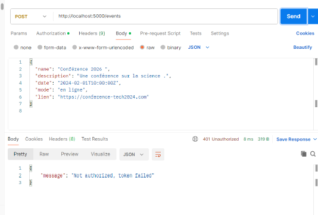


---

## 💅 Structure du Frontend
      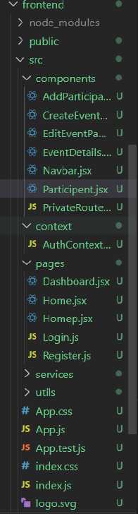

### `components/`
- `AddParticipant.jsx`, `CreateEvent.jsx`, `EditEventParticipant.jsx` — gestion des événements  
- `EventDetails.jsx` — affichage détaillé  
- `Navbar.jsx` — barre de navigation  
- `PrivateRoute.jsx` — protège les routes privées  

### `context/AuthContext.js`
- Gestion globale de l’état d’authentification (JWT, utilisateur connecté)

### `pages/`
- `Dashboard.jsx` — tableau de bord organisateur  
- `Home.jsx`, `Homep.jsx` — pages d’accueil  
- `Login.js`, `Register.js` — formulaires d’authentification  

### `services/`
- Gestion des appels API (non détaillée ici)

### Fichiers principaux :
- `App.js` : définit les routes  
- `App.css`, `index.css` : styles globaux  
- `index.js` : point de montage React  

---

## 🧪 Tests Frontend

- Page d’inscription
        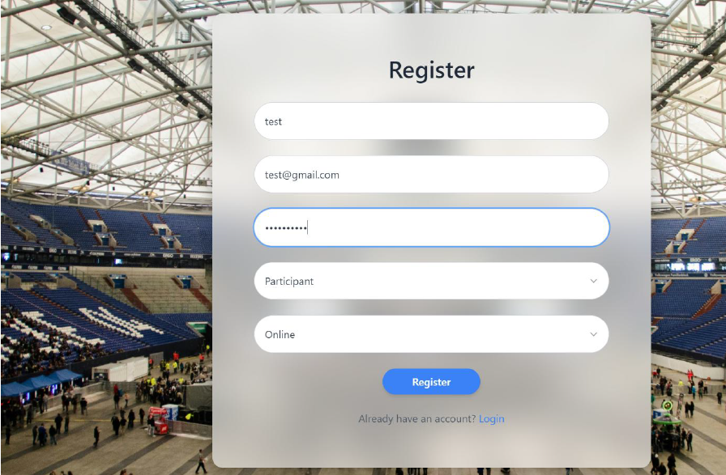

- Vérification de la création dans la base de données
        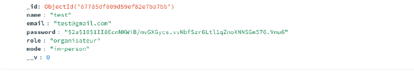

- Page de connexion
        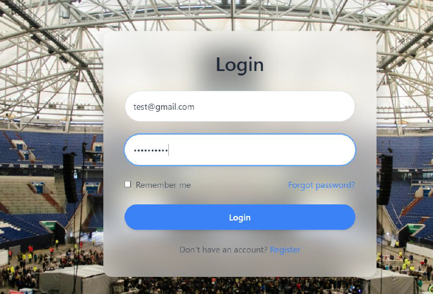

- Création d’un événement
        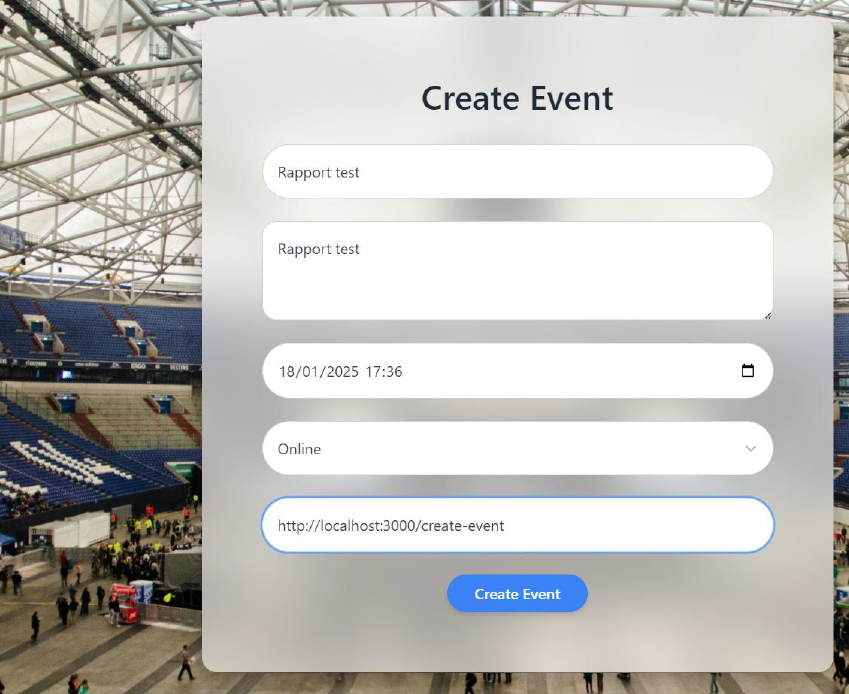

- Vérification de la présence dans la base de données  
      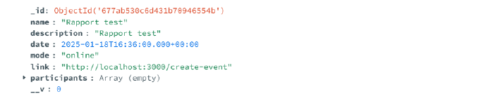

---

## 🐳 Déploiement avec Docker

### Fichiers :
- `Dockerfile` Backend
        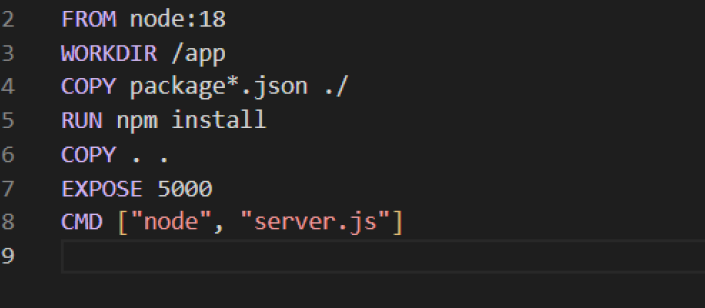

- `Dockerfile` Frontend
        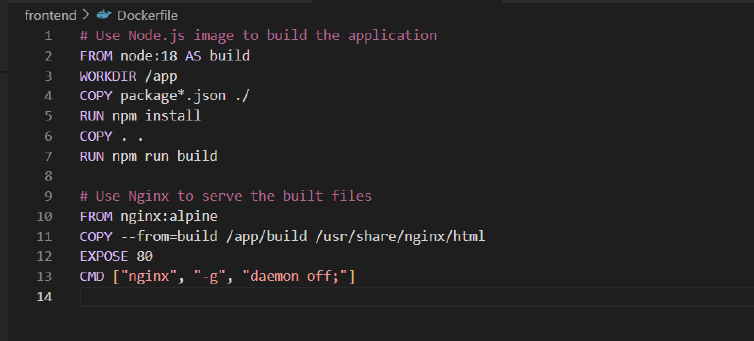

- `docker-compose.yml`  
      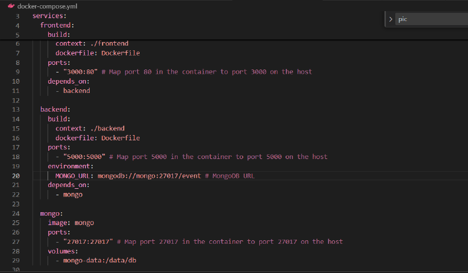

### Étapes :
1. **Création des containers**
         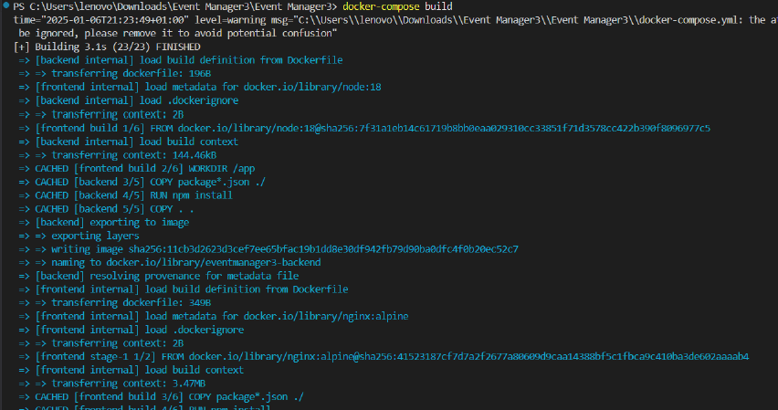

3. **Lancement des containers**
            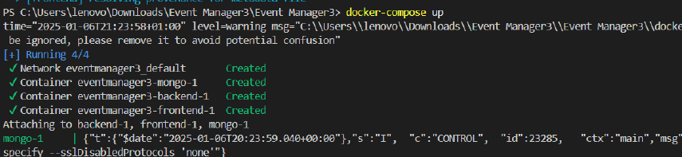
            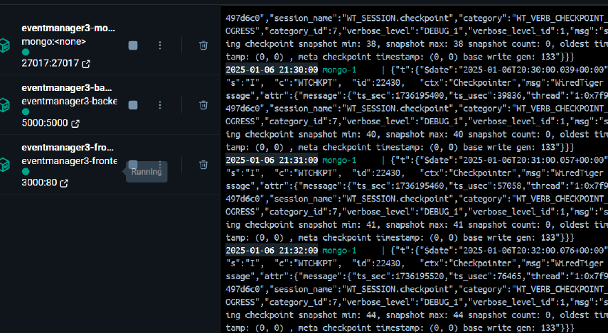

5. **Connexion à la base de données**
            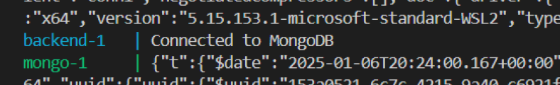

7. **Vérification du frontend :**
   ```bash
   http://localhost:3000

  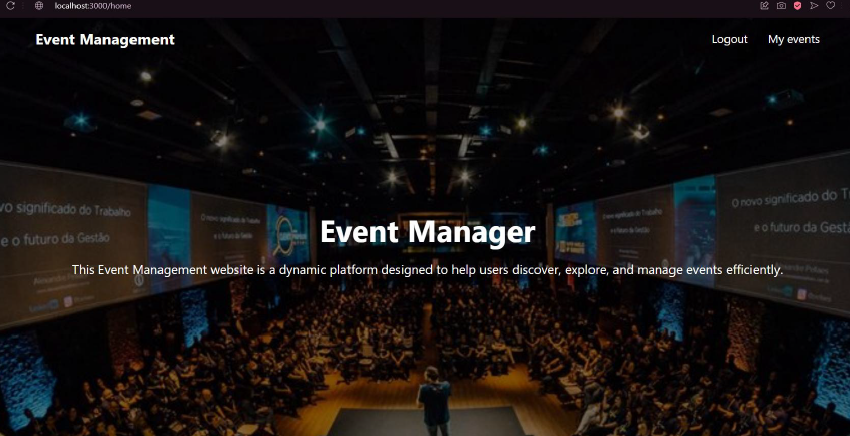

---

## 🏁 Conclusion

Ce projet de **gestion des événements hybrides** constitue une solution complète combinant un **backend robuste** et un **frontend moderne**.

Grâce à **Node.js**, **Express**, **MongoDB** *(backend)* et **React + Tailwind CSS** *(frontend)*, il propose :

- 🔐 **Une gestion sécurisée des utilisateurs** (authentification, rôles)  
- 📅 **Une gestion fluide des événements** (création, mise à jour, participation)  
- 📊 **Une interface responsive et ergonomique**

Le code suit une **architecture claire et modulaire**, facilitant la **maintenance** et l’**évolution** du projet.

---

**Réalisée par :**  
Firdawsse Ahchouche & Zineb Feth-Eddine  
